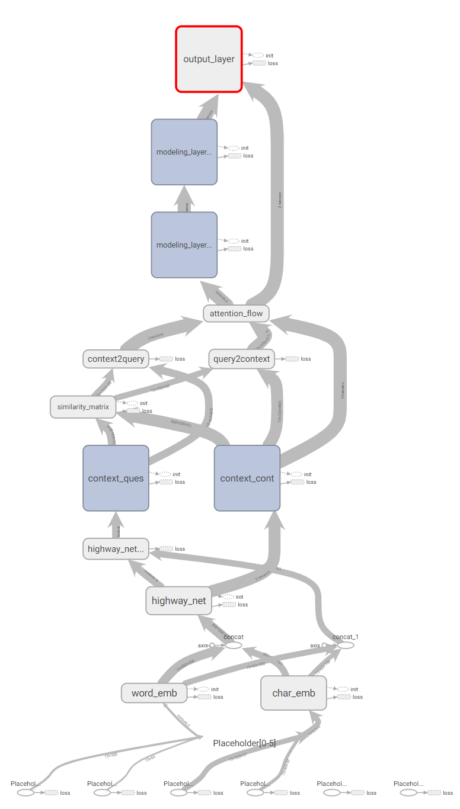

# BIDAF
Reimplementation Bi-Directional Attention Flow for Machine Comprehension

First of all, re-implement the BIDAF model with SQuAD dataset

and then, modifying model architecture to solve Multi-Sentence Reading Comprehension dataset

# Execution
For training your own model,
```
python main.py --is_train True
```

for evaluating your trained model
```
python main.py --is_train False
```

# Model Graph loss flow


# Dataset
(1) SQuAD dataset v1.1

(2) Multi-Sentence Reading Comprehension dataset (Multi-RC)
1. ~6k high-quality multiple-choice RC questions
2. 7 different sources, allowing more diversity in content, style, and possible question types.
3. Questions aren't constrained in single correct answer.

# Version Type
1. tensorflow version: 1.9.0
2. python version: 3.6.0

# Reference
* Model - https://arxiv.org/pdf/1611.01603.pdf
* Dataset - http://www.aclweb.org/anthology/N18-1023
